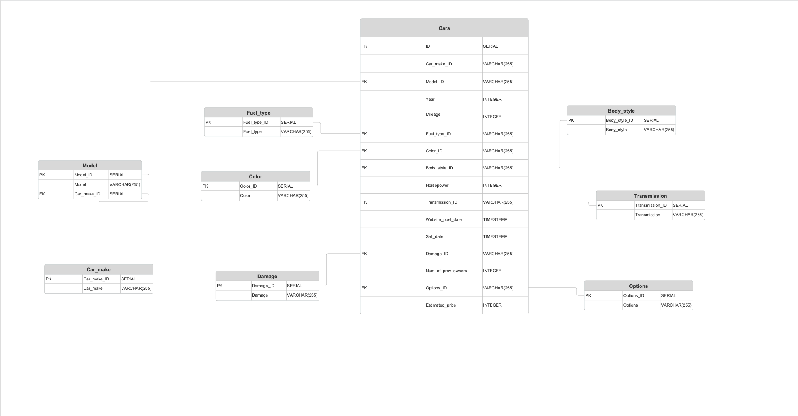

# Wheel-Deal

## Marketing analytics project

## Project Members

- Jeni Balaban - Project Manager
- Kristina Ayanyan - Data Scientist
- Mikayel Mikayelyan - Back-end Engineer
- Vahram Dressler - DB Developer
- Mher Ghevondian - Front-end Engineer


1. [Product Description](https://docs.google.com/document/d/1wBRiJaEN5ybGC3zcVq8OuZIsJu3I7SWc0s7CuLKW-ZY/edit?tab=t.0)
2. [Figma UI Prototype](https://www.figma.com/design/SGwS5yc76ng5AtCBYv6GRY/WheelDeal?node-id=0-1&t=H6y0TeJXTYgVBMxp-1)
3. [Product Roadmap](https://miro.com/app/board/uXjVLNxV--Y=/)
4. [Product Backlog](https://miro.com/app/board/uXjVLNzQhRQ=/)


## Installation


Before getting started, ensure you have the following prerequisites installed:

1. Clone the repository:
   ```bash
   git clone https://github.com/hovhannisyan91/pythonmicroservicedesign.git
   ```

2. Build and start the Docker containers:
   ```bash
   docker-compose up --build
   ```
## Access the Application

After running `docker-compose up --build`, you can access each component of the application at the following URLs:

- **VanillaJS Frontend**: [http://localhost:8080](http://localhost:8080)  
  The main web interface for doing car price predictions.

- **FastAPI Backend**: [http://localhost:8008](http://localhost:8008)  
  The backend API where requests are processed. You can use tools like [Swagger UI](http://localhost:8008/docs) (provided by FastAPI) to explore the API endpoints and their details.

- **PgAdmin** (optional): [http://localhost:5050](http://localhost:5050)  
  A graphical tool for PostgreSQL, which allows you to view and manage the database. Login using the credentials set in the `.env` file:
  
  - **Email**: Value of `PGADMIN_EMAIL` in your `.env` file
  - **Password**: Value of `PGADMIN_PASSWORD` in your `.env` file

> Note: Ensure Docker is running, and all environment variables in `.env` are correctly configured before accessing these URLs.


## Project structure

## Project Structure

Here’s an overview of the project’s file structure:
```bash

.
├── README.md
├── feedback.md
├── mkdocs.yml
├── ERD_final.png
└── myapp/
    ├── api/
    │   ├── .env
    │   ├── Dockerfile
    │   ├── main.py
    │   ├── requirements.txt
    │   └── Database/
    │       ├── database.py
    │       └── models.py
    ├── app/
    │   ├── fonts/ 
    │   ├── services/
    │   │   ├── options_services.js
    │   │   └── prediction_service.js
    │   ├── Dockerfile
    │   ├── index.html
    │   ├── index.js
    │   └── style.css
    ├── etl/
    │   ├── Database/
    │   │   ├── csv/
    │   │   │   ├── Wheel Deal Final.csv
    │   │   │   ├── car_sales_augmented.csv
    │   │   │   └── car_sales_fact.csv
    │   │   ├── __init__.py
    │   │   ├── data_simulation.py
    │   │   ├── database.py
    │   │   └── models.py
    │   ├── data/
    │   │   └── .gitkeep
    │   ├── .env
    │   ├── Dockerfile
    │   ├── __init__.py
    │   ├── etl.py
    │   └── requirements.txt
    ├── model/
    │   ├── catboost_info/
    │   ├── models/
    │   │   ├── catboost_sell_time_model.pkl
    │   │   └── elastic_net_price_model.pkl
    │   ├── car_sales_augmented.csv
    │   └── train.py
    ├── .env
    └── docker-compose.yaml

```

## Docker 

This repository sets up a Docker environment with three main services:

1. **PostgreSQL:** for data storage
2. **pgAdmin:** for database management and visualization
3. **ETL:** service for Extract, Transform, Load operations using Python
4. **Web Interface:** web interface for user interaction, done with VanillaJS, hosted with Nginx

The docker orchestration is done with docker compose, you can view the docker-compose.yml and the corresponding Dockerfiles in the project.

## Prerequisites

Before running this setup, ensure Docker and Docker Compose are installed on your system.


- Docker: [Install Docker](https://docs.docker.com/get-docker/)
- Docker Compose: [Install Docker Compose](https://docs.docker.com/compose/install/)


## DB

- Access pgAdmin for PostgreSQL management: [http://localhost:5050](http://localhost:5050)
    - username: admin@admin.com 
    - password: admin
    - When running for the first time, you must create a server. Configure it as shown in the below image (Password is blurred it should be `password`.)
    ![Server Setup]

### Environment Variables

For the purpose of easy management and easy checking, the .env file is pushed to the remote repository.

## ETL 

### Schema Design

We will try to create below schema:




In `models.py`, we have used `sqlalchemy` package, which allows map python objects with SQL objects.

By running `etl.py` following objects will be created:
    - sql tables 
    - the data sets will store in `data\` folder
    - the csv files will be loaded into DB


## API


### Features

- **Predict car price and estimated sale time**: Predict the car price and EST based on the cars features.
- **Get car features**: Returns all of the cars features. 

### Requests
- `POST /predict` Returns the prediction of the cars price and EST
- `GET /make-options` Returns the cars make options (Ford, Chevrolet, Mercedes...)
- `GET /model-options/{makeId}` Returns the cars model options based on the makeId (Focus, Fiesta, Fusion for Ford)
- `GET /fuel-type-options` Returns the cars fuel type options (Gasoline, Diesel, Electric...)
- `GET /color-options` Returns the cars color options (Red, Green, Black...)
- `GET /body-style-options` Returns the cars body style options (SUV, Truck, Wagon...)
- `GET /transmission-options` Returns the cars color options (Automatic, Manual)
- `GET /car-option-options`Returns the cars construction options (Base, Luxe...)
- `GET /car-damage-options` Returns the cars damage level options (Total, None, Medium...)


## Web Application

The web application is done with plain HTML, JS and CSS code, it is hosted on an Nginx server.


To Open the web app visit: [here](http://localhost:8080/) 

### Dockerfile

```Dockerfile
FROM nginx:latest

WORKDIR /usr/share/nginx/html

RUN rm -rf ./*

COPY ./* /usr/share/nginx/html/

EXPOSE 80

CMD ["nginx", "-g", "daemon off;"]
```